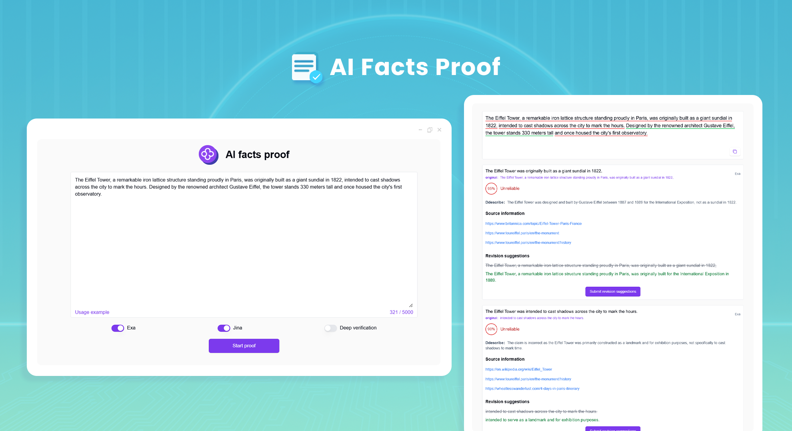
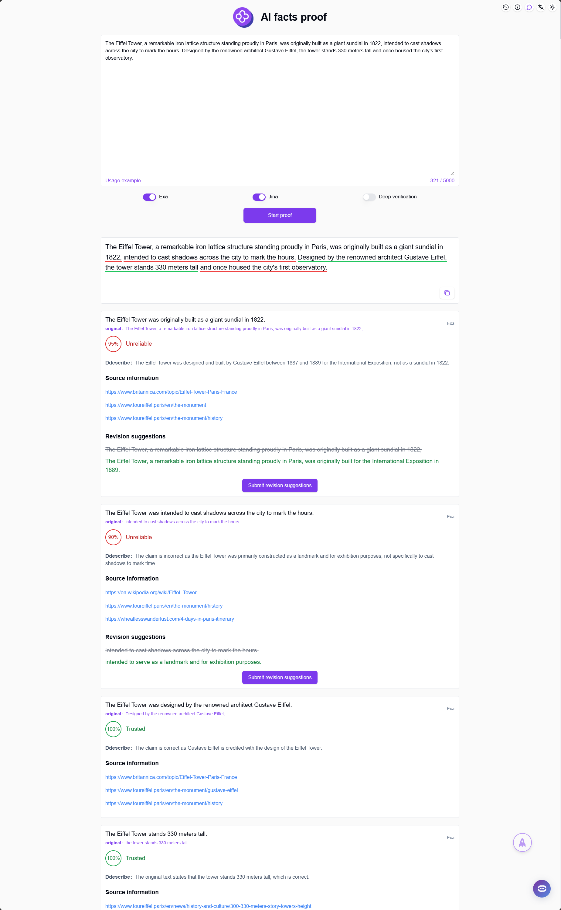

# 
🧪 AI facts proof 🚀✨

AI facts proof uses AI to break down concepts that need to be verified in the input content, and uses Jina or Exa to search for related concepts to verify whether the content expression is valid.

<a href="README_zh.md">中文</a> | <a href="README.md">English</a> | <a href="README_ja.md">日本語</a>

The open-source version of [AI facts proof](https://302.ai/product/detail/62) from [302.AI](https://302.ai/en/).
You can directly log in to 302.AI to use the online version with zero code and zero configuration.
Or modify this project according to your needs, input 302.AI's API KEY, and deploy it yourself.

## Interface Preview
Enter content, and AI will break down concepts that need to be verified. You can use Jina or Exa to search for related concepts to verify whether the content expression is valid.
      

## Project Features
### ⚡ Intelligent Concept Analysis
- AI automatically identifies and breaks down key concepts that need verification in the input content
### 🔄 Multi-Engine Search
- Supports both Jina and Exa search engines
- Can switch between different search sources based on needs
### 🧪 Fact Verification
- Automatically searches for evidence of related concepts
- Intelligent analysis of content authenticity
### 🤖 Result Analysis
- Provides detailed verification result analysis
- Gives credibility scores
### 📑 History Records
- Supports saving verification history records
### 🌍 Multi-language Support
- Chinese Interface
- English Interface
- Japanese Interface

## 🚩 Future Update Plans 
- [ ] Add support for more search engines

## Tech Stack
- React
- Tailwind CSS
- Radix UI

## Development & Deployment
1. Clone project `git clone https://github.com/302ai/302_facts_proof`
2. Install dependencies `npm install`
3. Configure 302's API KEY (refer to .env.example)
4. Run project `npm run dev`
5. Build and deploy `docker build -t coder-generator . && docker run -p 3000:3000 coder-generator`

## ✨ About 302.AI ✨
[302.AI](https://302.ai/en/) is an enterprise-oriented AI application platform that offers pay-as-you-go services, ready-to-use solutions, and an open-source ecosystem.✨
1. 🧠 Integrates the latest and most comprehensive AI capabilities and brands, including but not limited to language models, image models, voice models, and video models.
2. 🚀 Develops deep applications based on foundation models - we develop real AI products, not just simple chatbots
3. 💰 Zero monthly fee, all features are pay-per-use, fully open, achieving truly low barriers with high potential.
4. 🛠 Powerful management backend for teams and SMEs - one person manages, many people use.
5. 🔗 All AI capabilities provide API access, all tools are open source and customizable (in progress).
6. 💡 Strong development team, launching 2-3 new applications weekly, products updated daily. Developers interested in joining are welcome to contact us.
