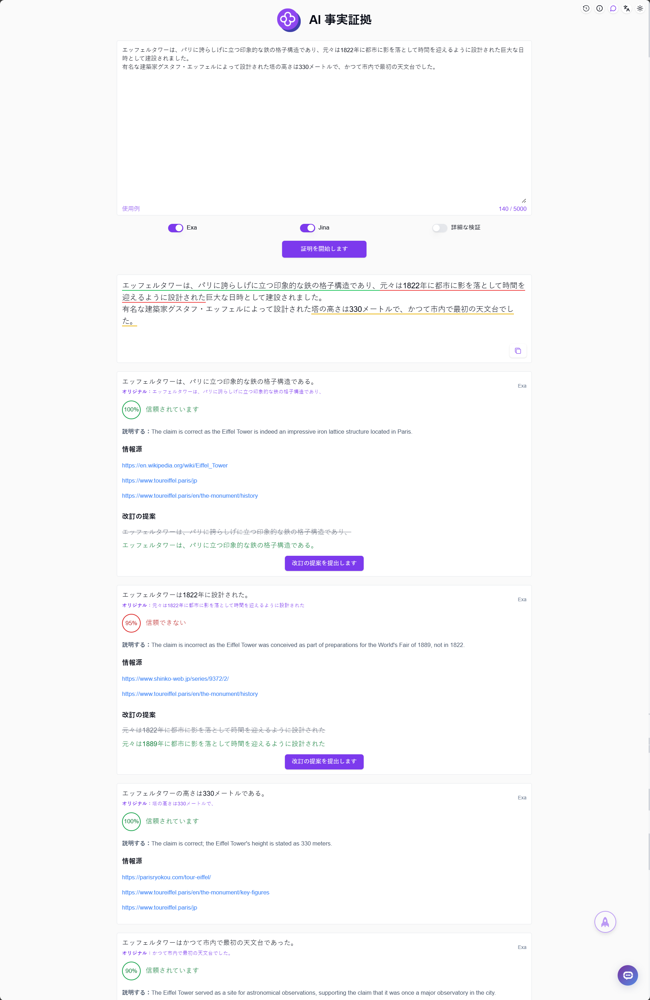

# 
🧪 AI 事実証拠 🚀✨

AI事実証拠は、入力内容から検証が必要な概念をAIで分解し、JinaやExaを使用して関連する概念を検索し、その内容の妥当性を検証します。

<a href="README_zh.md">中文</a> | <a href="README.md">English</a> | <a href="README_ja.md">日本語</a>

これは[302.AI](https://302.ai/ja/)の[AI 事実証拠](https://302.ai/ja/tools/verify/)のオープンソース版です。
302.AIに直接ログインして、コーディング不要で設定不要のオンラインバージョンをご利用いただけます。
また、このプロジェクトをご自身のニーズに合わせて修正し、302.AIのAPI KEYを設定して独自にデプロイすることも可能です。

## インターフェースプレビュー
入力内容からAIが検証が必要な概念を分解し、JinaやExaを使用して関連する概念を検索して、その内容の妥当性を検証します。
      

## プロジェクトの特徴
### ⚡ インテリジェント概念分解
- AIが入力内容から検証が必要な重要な概念を自動的に識別・分解
### 🔄 マルチエンジン検索
- JinaとExaの2つの検索エンジンをサポート
- 必要に応じて異なる検索ソースに切り替え可能
### 🧪 事実検証
- 関連する概念の証拠を自動検索
- 内容の真実性をインテリジェントに分析
### 🤖 結果分析
- 詳細な検証結果分析を提供
- 信頼性スコアを提示
### 📑 履歴記録
- 検証履歴の保存をサポート
### 🌍 多言語サポート
- 中国語インターフェース
- 英語インターフェース
- 日本語インターフェース

## 🚩 今後のアップデート計画
- [ ] より多くの検索エンジンのサポートを追加

## 技術スタック
- React
- Tailwind CSS
- Radix UI

## 開発とデプロイ
1. プロジェクトのクローン `git clone https://github.com/302ai/302_facts_proof`
2. 依存関係のインストール `npm install`
3. 302のAPI KEYの設定 .env.exampleを参照
4. プロジェクトの実行 `npm run dev`
5. ビルドとデプロイ `docker build -t coder-generator . && docker run -p 3000:3000 coder-generator`

## ✨ 302.AIについて ✨
[302.AI](https://302.ai/ja/)は企業向けのAIアプリケーションプラットフォームであり、必要に応じて支払い、すぐに使用できるオープンソースのエコシステムです。✨
1. 🧠 言語モデル、画像モデル、音声モデル、動画モデルなど、最新かつ包括的なAI機能とブランドを集約
2. 🚀 基本モデルの上に深層アプリケーション開発を行い、単なるチャットボットではなく、真のAI製品を開発
3. 💰 月額料金なし、すべての機能を従量課金制で提供し、参入障壁を低く、可能性を高く
4. 🛠 チームや中小企業向けの強力な管理バックエンド、一人で管理し、多人数で利用可能
5. 🔗 すべてのAI機能にAPIアクセスを提供し、すべてのツールをオープンソースでカスタマイズ可能（進行中）
6. 💡 強力な開発チームが週に2-3個の新アプリケーションをリリース、製品は毎日更新。開発者の参加も歓迎
