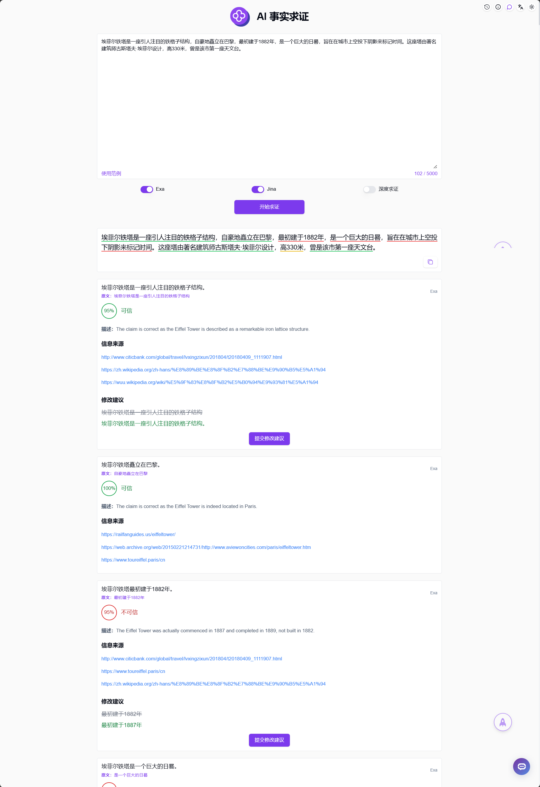

# <p align="center">🧪 AI 事实求证 🚀✨</p>

<p align="center">AI事实求证通过AI拆解输入内容中需要查证的概念，并使用Jina或Exa来搜索相关的概念证实该内容表达是否成立。</p>

<p align="center"><a href="https://302.ai/tools/verify/" target="blank"></a></p >

<p align="center"><a href="README_zh.md">中文</a> | <a href="README.md">English</a> | <a href="README_ja.md">日本語</a></p>


来自[302.AI](https://302.ai)的[AI 事实求证](https://302.ai/tools/verify/)的开源版本。你可以直接登录302.AI，零代码零配置使用在线版本。或者对本项目根据自己的需求进行修改，传入302.AI的API KEY，自行部署。

## 界面预览
输入内容，AI将会拆解输入内容中需要查证的概念，可使用Jina或Exa搜索相关的概念来证实该内容表达是否成立。
      


## 项目特性
### ⚡ 智能拆解概念
- AI自动识别和拆解输入内容中需要验证的关键概念
### 🔄 多引擎搜索
- 支持Jina和Exa两种搜索引擎
- 可根据需求切换不同的搜索源
### 🧪 事实验证
- 自动搜索相关概念的证据
- 智能分析内容真实性
### 🤖 结果分析
- 提供详细的验证结果分析
- 给出可信度评分
### 📑 历史记录
- 支持保存验证历史记录
### 🌍 多语言支持
- 中文界面
- English Interface
- 日本語インターフェース

## 🚩 未来更新计划
- [ ] 增加更多搜索引擎支持

## 🛠️ 技术栈

- **框架**: Next.js 14
- **语言**: TypeScript
- **样式**: TailwindCSS
- **UI组件**: Radix UI
- **状态管理**: Jotai
- **表单处理**: React Hook Form
- **HTTP客户端**: ky
- **国际化**: next-intl
- **主题**: next-themes
- **代码规范**: ESLint, Prettier
- **提交规范**: Husky, Commitlint

## 开发&部署
1. 克隆项目
```bash
git clone https://github.com/302ai/302_facts_proof
cd 302_facts_proof
```

2. 安装依赖
```bash
pnpm install
```

3. 环境配置
```bash
cp .env.example .env.local
```
根据需要修改 `.env.local` 中的环境变量。

4. 启动开发服务器
```bash
pnpm dev
```

5. 构建生产版本
```bash
pnpm build
pnpm start
```

## ✨ 302.AI介绍 ✨
[302.AI](https://302.ai)是一个面向企业的AI应用平台，按需付费，开箱即用，开源生态。✨
1. 🧠 集合了最新最全的AI能力和品牌，包括但不限于语言模型、图像模型、声音模型、视频模型。
2. 🚀 在基础模型上进行深度应用开发，我们开发真正的AI产品，而不是简单的对话机器人
3. 💰 零月费，所有功能按需付费，全面开放，做到真正的门槛低，上限高。
4. 🛠 功能强大的管理后台，面向团队和中小企业，一人管理，多人使用。
5. 🔗 所有AI能力均提供API接入，所有工具开源可自行定制（进行中）。
6. 💡 强大的开发团队，每周推出2-3个新应用，产品每日更新。有兴趣加入的开发者也欢迎联系我们
